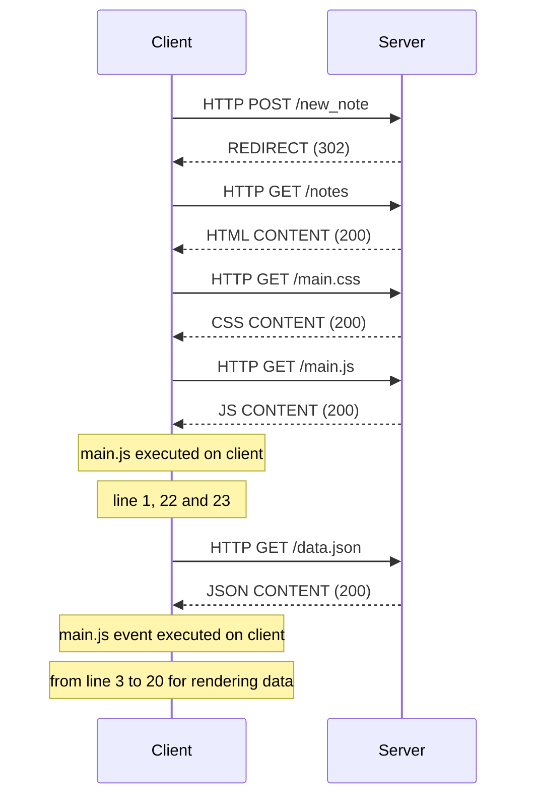

```mermaid
sequenceDiagram
Client->>Server: HTTP POST /new_note
Server-->>Client: REDIRECT (302)
Client->>Server: HTTP GET /notes
Server-->>Client: HTML CONTENT (200)
Client->>Server: HTTP GET /main.css
Server-->>Client: CSS CONTENT (200)
Client->>Server: HTTP GET /main.js
Server-->>Client: JS CONTENT (200)
Note over Client: main.js executed on client
Note over Client: line 1, 22 and 23
Client->>Server: HTTP GET /data.json
Server-->>Client: JSON CONTENT (200)
Note over Client: main.js event executed on client
Note over Client: from line 3 to 20 for rendering data
```