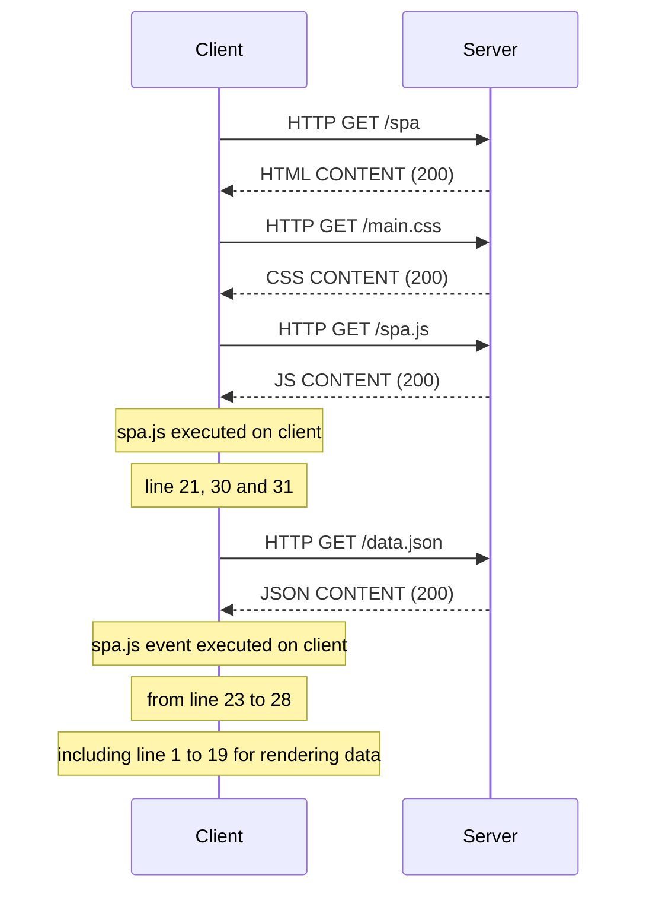

```mermaid
sequenceDiagram
Client->>Server: HTTP GET /spa
Server-->>Client: HTML CONTENT (200)
Client->>Server: HTTP GET /main.css
Server-->>Client: CSS CONTENT (200)
Client->>Server: HTTP GET /spa.js
Server-->>Client: JS CONTENT (200)
Note over Client: spa.js executed on client
Note over Client: line 21, 30 and 31
Client->>Server: HTTP GET /data.json
Server-->>Client: JSON CONTENT (200)
Note over Client: spa.js event executed on client
Note over Client: from line 23 to 28
Note over Client: including line 1 to 19 for rendering data

```